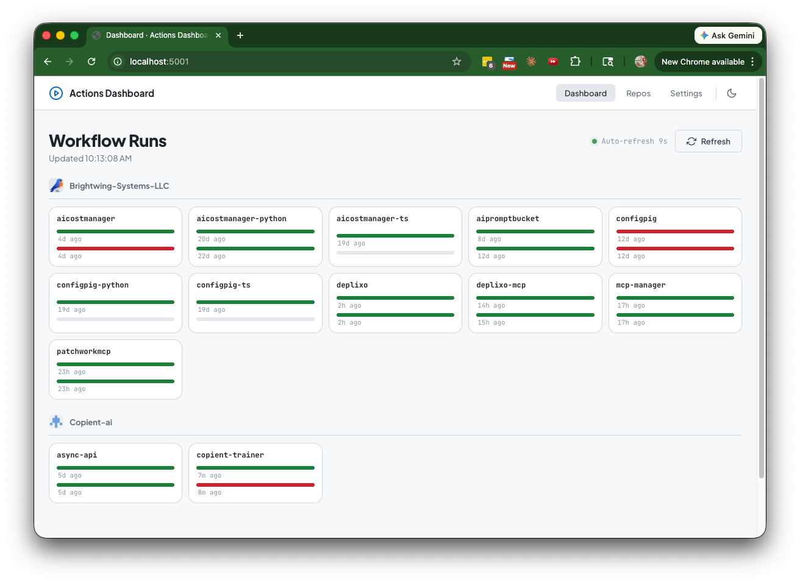
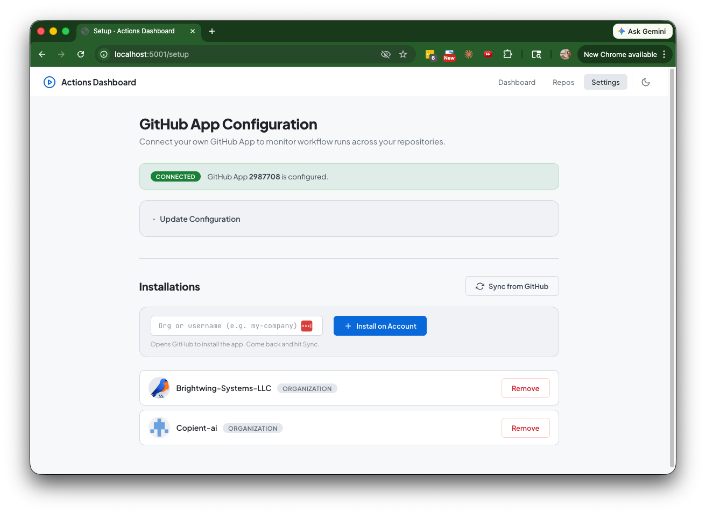
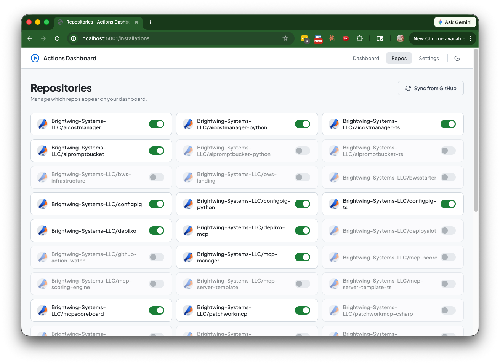

# GitHub Action Watch

A self-hosted dashboard that aggregates GitHub Actions workflow runs across multiple repositories and organizations into a single view.



## Features

- **At-a-glance status** -- one card per repo, five across, with color-coded build bars (green = success, red = failure, blue animated = in progress)
- **Grouped by org** -- repos are grouped under their org/user with avatar and divider
- **Click to drill down** -- each status bar links directly to the workflow run on GitHub
- **Auto-refresh** -- dashboard polls every 10 seconds
- **Dark/light theme** -- toggles via the nav bar, respects system preference
- **Repo management** -- toggle which repos appear on the dashboard from the Repos page

## Prerequisites

- Python 3.11+
- [uv](https://docs.astral.sh/uv/) (recommended) or pip

## Quickstart

### 1. Clone and run

```bash
git clone https://github.com/Brightwing-Systems-LLC/github-action-watch.git
cd github-action-watch
uv run app.py
```

The app starts at **http://localhost:5001**.

### 2. Create a GitHub App

On first launch you'll land on the **Settings** page. The recommended path is the one-click manifest flow:

1. Optionally enter an **App name** (must be globally unique on GitHub) and an **Organization** (leave blank for your personal account).
2. Click **Create GitHub App**.
3. GitHub shows a pre-filled app creation page with the correct permissions (`actions: read`, `metadata: read`). Click **Create GitHub App** on GitHub.
4. You're redirected back and the app is now connected.



#### Alternative: use an existing GitHub App

If you already have a GitHub App with `actions: read` and `metadata: read` permissions:

1. Expand **Use an Existing App** on the Settings page.
2. Enter your **App ID**, **Client ID**, **Client Secret**, and upload the **Private Key** (`.pem` file).
3. Optionally enter a **Webhook Secret**.
4. Click **Save & Continue**.

### 3. Install on your organizations/accounts

Still on the Settings page, under **Installations**:

1. Enter an org or username in the input field and click **Install on Account**. This opens GitHub's installation flow in a new tab.
2. On GitHub, select the repositories you want the app to access (or grant access to all), then click **Install**.
3. Back on the Settings page, click **Sync from GitHub** to discover the new installation and its repos.

Repeat for each org or account you want to monitor.

### 4. Choose which repos to monitor

Navigate to the **Repos** page. Every repo the app has access to is listed with a toggle switch. Enable or disable repos to control which ones appear on the dashboard.



### 5. View the dashboard

Navigate to **Dashboard**. You'll see your repos as compact cards grouped by org, each showing the last two workflow runs. The page auto-refreshes every 10 seconds.

## Configuration

All configuration is optional and done via environment variables:

| Variable | Default | Description |
|---|---|---|
| `PORT` | `5001` | Port to listen on |
| `FLASK_SECRET_KEY` | random | Session secret key |
| `FLASK_DEBUG` | `true` | Enable Flask debug mode |
| `DATABASE_PATH` | `dashboard.db` | Path to the SQLite database |
| `LOOKBACK_DAYS` | `7` | How many days of runs to consider |

## Data storage

All data is stored locally in a single SQLite database (`dashboard.db` by default):

- GitHub App credentials (app ID, client ID, client secret, private key)
- Installation records (org/user accounts)
- Monitored repos and their active/inactive status
- Cached workflow runs (for fast initial page loads)

No data is sent to any third party. The app only communicates with the GitHub API.
